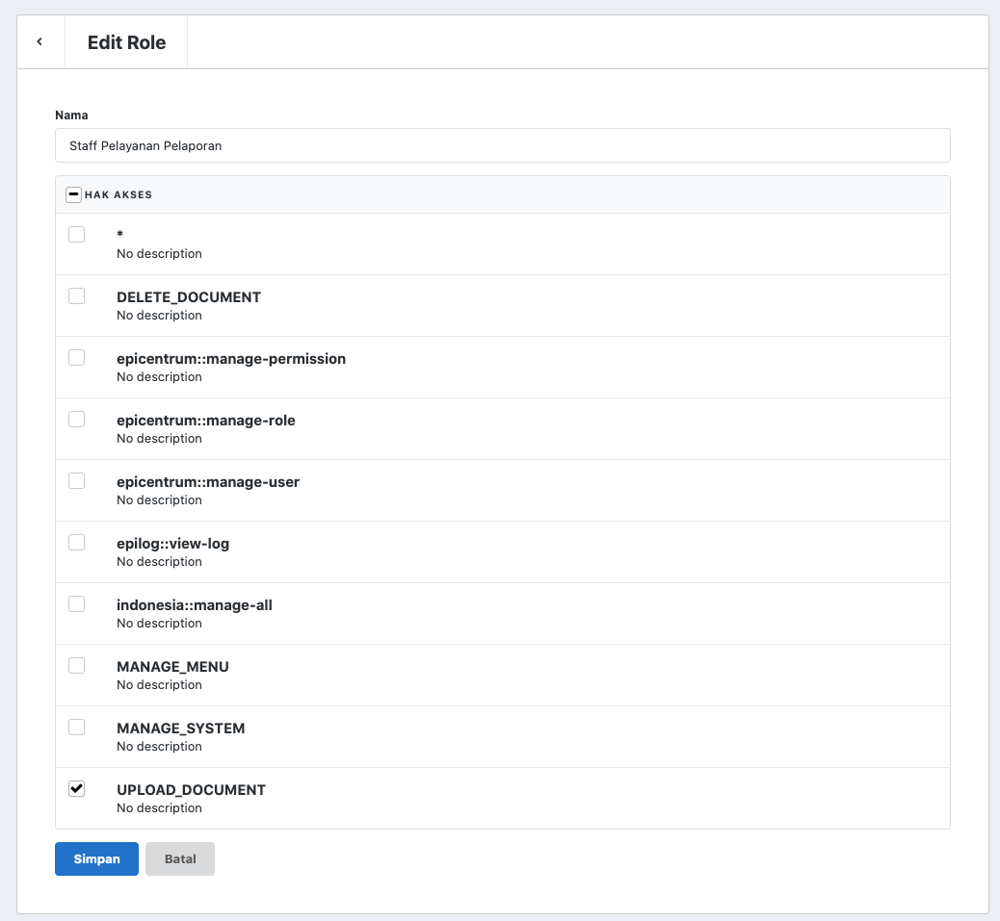

# ACL

## Istilah

### User

User adalah pengguna yang memiliki akun dan bisa login ke aplikasi.

### Role

Role, atau sering juga disebut dengan istilah *user group*, adalah istilah yang dipakai untuk mengelompokkan User yang sejenis agar lebih diatur hak aksesnya.

Contoh Role dalam aplikasi nyata:

- Sistem Informasi Rumah Sakit
    - Administrator
    - Dokter
    - Perawat
    - Apoteker
    - Admin Keuangan
    - Kasir
- Sistem Informasi Akademik
    - Administrator
    - Dosen
    - Dosen Wali
    - Mahasiswa
    - TU
    - Rektor

Seorang User bisa memiliki satu atau lebih Role. Laravolt mendefinisikan User dan Role dalam relasi Many to Many. 

### Permission

Permission, atau sering disebut dengan *ability*, adalah istilah yang dipakai untuk mendefinisikan kemampuan yang harus dimiliki oleh seorang User sebelum bisa mengakses sebuah fitur.

Contoh Permission dalam aplikasi nyata:

- Sistem Informasi Rumah Sakit
    - Bisa input pasien
    - Bisa melihat rekam medis
    - Bisa melihat dashboard keuangan
    - Bisa melihat stok obat
    - Bisa mengubah stok obat
- Sistem Informasi Akademik
    - Bisa input KRS
    - Bisa melihat profil mahasiswa
    - Bisa membuat jadwal
    - Bisa input nilai mata kuliah
    - Bisa download KRS

Laravolt mendefinisikan relasi Many to Many antara Permission dan Role. Jadi, Permission itu menempel ke Role, bukan ke User. 

## ERD

<iframe width="100%" height="300" src='https://dbdiagram.io/embed/5fbb7d653a78976d7b7d0427'> </iframe>

## Pengecekan Hak Akses

Ada 2 metode pengecekan hak akses yang biasa dilakukan:

1. Mengecek Role
2. Mengecek Permission

```php
// MENGECEK ROLE

if (auth()->user()->hasRole(['Administrator'])) {
  // allow to access
}
```

```php
// MENGECEK PERMISSION

if (auth()->user()->can('see_dashboard')) {
    // allow to access
}
```

Lalu ada perubahan requirement. Selain Administrator, Direktur RS juga bisa melihat dashboard.

```php
// MENGECEK ROLE

if (auth()->user()->hasRole(['Administrator', 'Direktur RS'])) {
  // allow to access
}
```

```php
// MENGECEK PERMISSION

if (auth()->user()->can('see_dashboard')) {
    // allow to access
}
```

Anda bisa melihat, tidak ada perubahan kode jika kita melakukan pengecekan dengan Permission.

Kenapa bisa begitu?

## Fixed Permission, Dynamic Role

Jika pengecekan dilakukan terhadap Permission, maka ketika ada perubahan requirement terkait hak akses, yang perlu dilakukan hanyalah mengubah permissions dari Role yang bersangkutan. Dan hal tersebut bisa dilakukan admin sistem lewat admin panel yang telah disediakan.



Sebaliknya, jika pengecekan dilakukan terhadap Role, setiap kali ada perubahan kondisi maka kode aplikasi juga harus disesuaikan. Tentu hal ini tidak cukup efektif. Selain itu, bisa jadi nama Role ini berubah. Apa yang terjadi jika "Direktur RS" diubah menjadi "Direktur Utama RS"?


> **Fixed Permissions, Dynamic Roles**
>
> Permission itu fix jumlah dan namanya, sesuai definisi fitur aplikasi. Role itu dinamis, Admin bisa menambah atau mengurangi sesuai kebutuhan. Ketika ada perubahan requirement terkait hak akses, maka yang perlu dilakukan hanyalah mengubah mapping role-permission.

