# Suitable

## Intro

Suitable adalah helper untuk menampilkan data dari Eloquent menjadi tabel (datatable) dengan struktur HTML sesuai standard Fomantic UI. Fitur-fitur yang tersedia:

1. Membuat *full featured datatable* dengan 1 baris kode
2. Column sorting (server side)
3. Column filtering (server side)
4. Searching (server side)
5. Ekspor ke PDF, CSV, XLS, XLSX (server side)
6. Pagination (server side)
7. Custom column definition

Semua pengolahan data dilakukan di server side tanpa bantuan Javascript. Untuk meningkatkan response time ketika melakukan navigasi, sangat disarankan untuk menggunakan teknologi seperti:

- [Turbolinks](https://github.com/turbolinks/turbolinks)
- [Pjax (Versi jQuery)](https://github.com/defunkt/jquery-pjax)
- [Pjax (Versi Non jQuery)](https://github.com/MoOx/pjax)
- https://swup.js.org/

Penggunaan salah satu teknologi di atas memungkinkan untuk melakukan transisi halaman web secara lebih halus, tanpa full page refresh. Aplikasi web bisa dibuat seolah-olah mirip Single Page Application, meskipun stack yang digunakan murni server side rendering.

## Installation

```bash
composer require laravolt/suitable
```

Jika diperlukan, `config` dan `views` bisa di-*publish* untuk dimodifikasi sesuai kebutuhan:

```bash
php artisan vendor:publish --tag=views --tag=config --provider="Laravolt\Suitable\ServiceProvider"
```

## Konfigurasi

##### `laravolt.suitable.query_string.sort_by`

Query string untuk menentukan kolom sorting.

Default value: `“sort”`

##### `laravolt.suitable.query_string.sort_direction`  

Query string untuk metode sorting.

Default value: `“direction”`

##### `laravolt.suitable.query_string.search`  

Query string untuk keyword pencarian.

Default value: `“search”`

##### `laravolt.suitable.restful_button.delete_confirmation_fields`

Nama-nama kolom yang akan dipakai sebagai *identifier* ketika menampilkan konfirmasi penghapusan data. Suitable akan mengecek semua kolom yang diisikan dan mengambil kolom pertama yang cocok. 

Default value: `['title', 'name']`

## Cara Pemakaian

Ada 2 cara pemakaian Suitable untuk menampilkan tabel, yaitu sebagai HTML Builder atau sebagai TableView. Sebagai HTML Builder, kamu langsung memanggil helper class `Suitable` untuk mendefinisikan tabel yang ingin dihasilkan. Builder hanya bertugas menghasilkan `string` HTML. Titik.

Sedangkan sebagai TableView, sebuah tabel direpresentasikan dalam sebuah kelas `TableView` dimana kelas ini selain bertanggung jawab menghasilkan string HTML juga dapat digunakan untuk memanipulasi response dari `Controller`, misalnya untuk menghasilkan file PDF atau spreadsheet.

## HTML Builder

Penggunaan paling sederhana Suitable adalah sebagai HTML builder, dimana Suitable dapat menghasilkan tag HTML untuk menampilkan data dalam bentuk tabel. Output yang dihasilkan, setelah memanggil method `render()`, hanyalah string biasa. Oleh karena itu, pemanggilan Suitable bisa dilakukan dimana saja.

Memanggil `render()` langsung di view:

###### resources/views/users/index.blade.php

```php
{!! Suitable::source($data)->columns(['id','name'])->render() !!}
```

Atau bisa juga menyimpan string hasil `render()` ke sebuah variable sehingga view tinggal menampilkan saja:

###### UserController.php

```php
public function index()
{
  	$data = \App\User::all();
  	$table = Suitable::source($data)->columns(['id', 'name'])->render();

  return view('users.index', compact('table'));
}
```

###### resources/views/users/index.blade.php

```php
{!! $table !!}
```


### Contoh Pemakaian

##### Basic Table

```php
Suitable::source($users)
  ->columns(['id', 'name', 'email'])
  ->render()
```


##### Custom Header

```php
Suitable::source($users)
  ->columns([
    'id',
    ['header' => 'Nama', 'field' => 'name'],
    ['header' => 'Surel', 'field' => 'email'],
  ])
  ->render()
```


##### Raw HTML

```php
Suitable::source($users)
  ->columns([
    'id',
    ['header' => 'Nama', 'field' => 'name'],
    ['header' => 'Surel', 'raw' => function ($user) {
      return sprintf('<a href="mailto:%s">%s</a>', $user->email, $user->email);
    }],
  ])
  ->render()
```


##### Custom Cell View

###### resources/views/custom-cell.blade.php

```php
// Variable $data secara otomatis tersedia, merupakan item (object Eloquent) untuk row tersebut
Custom cell untuk user dengan ID {{ $data->getKey() }}
```

**Perhatian:** Tidak perlu menambahkan tag `<td>` karena Suitable akan menambahkannya secara otomatis.

###### resouces/views/index.blade.php

```php
Suitable::source($users)
  ->columns([
    'id',
    ['header' => 'Nama', 'field' => 'name'],
    ['header' => 'Custom Cell', 'view' => 'custom-cell'],
  ])
  ->render()
```

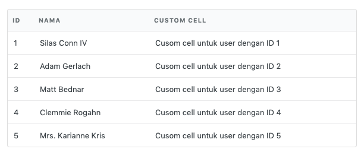

##### Custom Row View

Jika ingin membuat struktur row yang kompleks, maka bisa memanfaatkan method `row(string $view)`. Dengan custom row, maka struktur tabel bisa dikreasikan sebebas mungkin, misalnya melakukan merge cell dengan `rowspan`.

###### resources/views/custom-row.blade.php

```html
<tr>
    <td rowspan="2">{{ $data->getKey() }}</td>
    <td><strong>{{ $data->name }}</strong></td>
</tr>
<tr>
    <td>{{ $data->email }}</td>
</tr>
```

###### resources/views/index.blade.php

```php
Suitable::source($users)
  ->columns([
    'id',
    'Name/Email',
  ])
  ->row('custom-row')
  ->render()
```

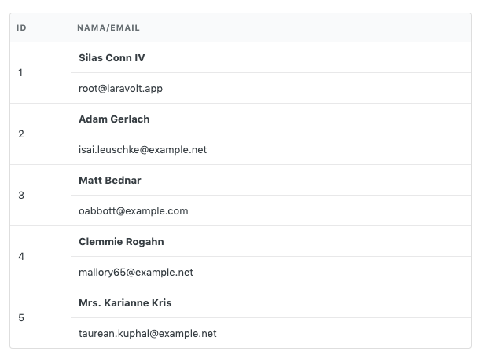

##### Searchbox

Untuk menampilkan kotak pencarian bisa memanggil method `search()`.

```php
Suitable::source($users)
    ->columns(['id', 'name', 'email'])
    ->search()
    ->render()
```

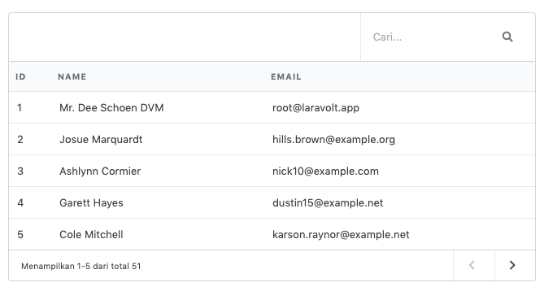

Melakukan pencarian di searchbox akan membuat terjadinya request ke URL saat ini dengan tambahan query string `?search=<foo>`. Query string `search` tersebut selanjutnya bisa digunakan di Controller untuk melakukan query ke database.

```php
class UserController 
{
    public function index()
    {
        $keyword = request()->get('search');       
        $users = \App\User::where('name', 'like', "%$keyword%")->get();

        // more action here...
    }
}
```

Query string bisa diganti dengan memberikan argumen ke fungsi `search($param)`.

```php
Suitable::source($users)
    ->columns(['id', 'name', 'email'])
    ->search('keyword')
    ->render()
```

Kode di atas akan menghasilkan URL seperti di bawah ini ketika pencarian dilakukan lewat searchbox yang disediakan:

```html
http://localhost/users?keyword=foo
```

Untuk mengganti nama query string secara global, bisa mengubah konfigurasi `laravolt.epicentrum.query_string.search`. 

> File konfigurasi bisa ditemukan di `config/laravolt/epicentrum.php`. 
>
> Jika file konfigurasi tidak tersedia, silakan lakukan langkah *publish vendor file* terlebih dahulu.

##### Column Filtering

Jika ingin menambahkan searchbox untuk kolom tertentu, bisa menambahkan opsi `searchable => <boolean>|<string>`.

```php
Suitable::source($users)
    ->columns([
        'id',
        ['header' => 'Nama', 'field' => 'name', 'searchable' => true],
        ['header' => 'Surel', 'field' => 'email', 'searchable' => 'email_adddress'],
    ])
    ->render()

```

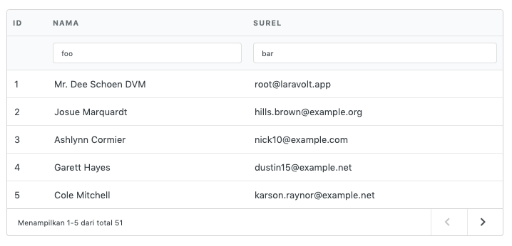

Pencarian bisa dilakukan dengan mengetikkan sesuatu di searchbox lalu **menekan tombol enter**. Pada contoh di atas, URL yang dihasilkan ketika melakukan pencarian adalah:

```html
http://localhost/users?filter[name]=foo&filter[email_address]=bar
```

Selanjutnya, query string `filter` bisa digunakan di Controller untuk melakukan filtering terhadap data yang ditampilkan, misalnya seperti di bawah ini:

```php
class UserController 
{
    public function index()
    {
        $query = \App\User::query();
        $filters = request()->get('filter');               
        foreach ($filters as $column => $keyword) {
            $query->where($column, 'like', "%$keyword%");
        }
		$users = $query->get();
        
        // more action here...
    }
}
```

> Suitable menyediakan Trait [AutoFilter](#auto-filter) yang bisa dipasang di Model. Setelah terpasang,  Model bisa memanggil scope `autoFilter()` dan secara otomatis akan menangani proses filtering data berdasar query string.

##### Column Sorting

Header kolom bisa dibuat agar *clickable* dan menghasilkan query string yang sesuai untuk proses sorting data dengan menambahkan opsi `sortable => <boolean>|<string>`. 

```php
Suitable::source($users)
    ->columns([
        'id',
        ['header' => 'Nama', 'field' => 'name', 'sortable' => true],
        ['header' => 'Surel', 'field' => 'email', 'sortable' => 'email_address'],
    ])
    ->render()
```

Kode di atas akan menghasilkan tabel dengan header kolom berubah menjadi link yang bisa diklik untuk mendukung proses sorting data.

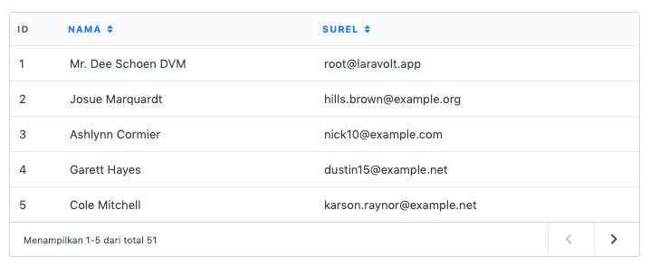

Mengklik salah satu kolom akan menghasilkan URL seperti di bawah ini:

```html
http://localhost/users?sort=name&direction=desc
```

Query string `sort` berisi nama kolom sedangkan `direction` menunjukkan metode sorting apakah `asc` atau `desc`. Kedua query string ini selanjutnya bisa digunakan di Controller untuk melakukan sorting data:

```php
class UserController 
{
    public function index()
    {
        $query = \App\User::query();
        $sort = request()->get('sort');               
        $direction = request()->get('direction');               
        
        if ($sort) {
            $query->orderBy($sort, $direction);
        }
        
        $users = $query->get();
        
        // more action here...
    }
}
```

> Suitable menyediakan Trait [AutoSort](#auto-sort) yang bisa dipasang di Model. Setelah terpasang, Model bisa memanggil scope `autoSort()` dan secara otomatis akan menangani proses sorting data berdasar query string.

## Table View 

TableView adalah sebuah `class` yang fungsinya khusus untuk menampilkan tabel. TableView memiliki fungsi yang sama dengan HTML Builder, dengan beberapa fitur tambahan:

1. Berbasis **class** sehingga reusable.
2. Mendukung sistem **plugin** untuk kemudahan memodifikasi setiap elemen tabel: header, kolom, dan footer. 
3. Otomatis bisa ekspor ke PDF, spreadsheet, dan CSV.


### Penggunaan

Berbeda dengan Suitable HTML Builder yang bisa dipanggil dimana saja, TableView direkomendasikan untuk dipanggil hanya dari Controller atau routes, karena sejatinya TableView adalah sebuah class [Responsable](https://laravel-news.com/laravel-5-5-responsable) yang bisa langsung mengembalikan response terhadap suatu request.  

Secara umum, ada tiga langkah yang diperlukan untuk menerapkan TableView:

1. Membuat class Table View
2. Memodifikasi response dari Controller
3. Menampilkan tabel di View

##### 1. Membuat Class Table View

###### app/Table/UserTableView.php

```php
use Laravolt\Suitable\TableView;

class UserTableView extends TableView
{
    protected function columns()
    {
        return ['id', 'title'];
    }
}
```

Cukup sederhana, method `columns()` sangat mirip dengan yang dimiliki oleh Suitable HTML Builder.

##### 2. Memodifikasi Response Dari Controller

Selanjutnya, proses di controller perlu sedikit diubah.

###### UserController.php

```php
// Before
public function index()
{
    $users = \App\User::paginate();

    return view('users.index', compact('users'));
}

// After
public function index()
{
    $users = \App\User::paginate();

    return (\App\Table\UserTableView::make($users))->view('users.index');
}

```

Ada beberapa hal yang patut diperhatikan dari potongan kode di atas:

1. Fungsi `view()` bawaan Laravel diganti dengan fungsi `view()` dari TableView, dengan parameter fungsi yang sama.
2. Dengan memanggil fungsi `view()` milik TableView, sebuah variable `$table` yang merupakan *instance* dari `UserTableView` secara otomatis akan di-passing ke view.

##### 3. Menampilkan Tabel Di View

###### resources/views/users/index.blade.php

```php
{!! $table !!}
```

## Column

Selain menggunakan format `array` seperti pada contoh-contoh di atas, pendefinisian kolom juga bisa dilakukan menggunakan *predefined* `Column` yang telah tersedia.

```php
use Laravolt\Suitable\Columns\Date;
use Laravolt\Suitable\Columns\DateTime;
use Laravolt\Suitable\Columns\Numbering;
use Laravolt\Suitable\Columns\Text;
use Laravolt\Suitable\TableView;

class UserTable extends TableView
{
    protected function columns()
    {
        return [
            Numbering::make('No'),
            Text::make('name'),
            Date::make('created_at', 'Member Since'),
            DateTime::make('updated_at', 'Last Login'),
        ];
    }
}
```


### Predefined Columns

##### Avatar

```php
use Laravolt\Suitable\Columns\Avatar;

Avatar::make('name', 'Avatar')
```

Avatar akan mengambil inisial dari field `nama` untuk menghasilkan avatar sederhana pengganti *profile picture*.

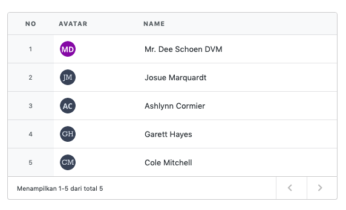

##### Boolean

```php
use Laravolt\Suitable\Columns\Boolean;

Boolean::make('status')
```

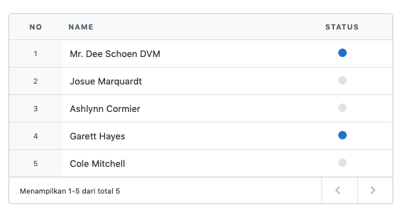

##### Date

`Date` digunakan untuk menampilkan tanggal dalam format yang manusiawi.

```php
use Laravolt\Suitable\Columns\Date;

Date::make('created_at', 'Member Since');
```

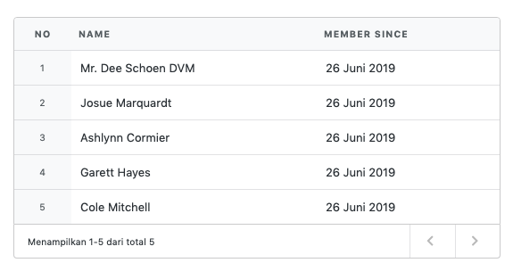

##### DateTime

`DateTime` digunakan untuk menampilkan tanggal dan jam dalam format yang manusiawi.

```php
use Laravolt\Suitable\Columns\DateTime;

DateTime::make('updated_at', 'Last Login');
```

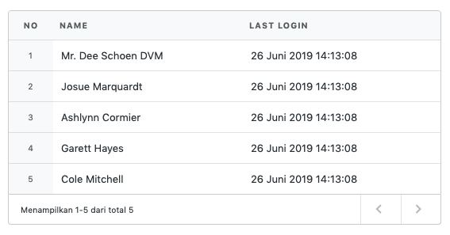

##### Id

Menampilkan `primary key` secara otomatis. Dibelakang layar, class ini akan memanggil `$model->getKey()` dari setiap data yang ditampilkan.

```php
use Laravolt\Suitable\Columns\Id;

Id::make();
```


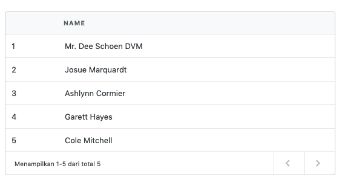

##### Numbering

Menampilkan `index` baris secara otomatis, dimulai dari angka 1.

```php
use Laravolt\Suitable\Columns\Numbering;

Numbering::make('No');
```

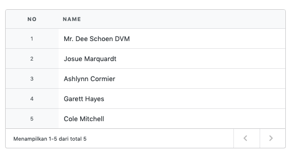

Tag `td` dan `th` yang dihasilkan secara otomatis akan mendapatkan CSS class `numbering`. Jika ingin memodifikasi style untuk kolom `numbering` bisa menambahkan CSS berikukt:

```css
table.ui.table thead th.numbering {
  // override style here
}

table.ui.table thead td.numbering {
  // override style here
}
```


##### Raw

Memanggil *Closure* untuk menampilkan isi kolom. Kamu bebas melakukan apapun di dalam Closure tersebut, selama hasil akhirnya adalah `string`.

```php
use Laravolt\Suitable\Columns\Raw;

Raw::make(function ($item) {
    return $item->roles->implode('name', ' & ');
}, 'Roles');
```

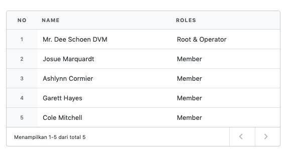

##### Restful Button

`RestfulButton` akan menampilkan 3 buah tombol yang biasa dipakai untuk melakukan operasi CRUD, yaitu view, edit, dan delete.

```php
use Laravolt\Suitable\Columns\RestfulButton;

RestfulButton::make('users');
```

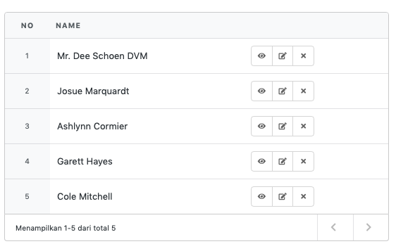

Beberapa method tambahan yang tersedia:

| Method   | Deskripsi                            |
| -------- | ------------------------------------ |
| `only`   | Aksi apa saja yang ingin ditampilkan |
| `except` | Aksi apa saja yang ingin dihilangkan |

```php
RestfulButton::make('users')->only("view", "edit");

RestfulButton::make('users')->excep("delete");
```


##### Text

`Text` akan menampilkan teks sama persis dengan yang tersimpan di database.

```php
use Laravolt\Suitable\Columns\Text;

View::text('name')
View::text('created_at')
```

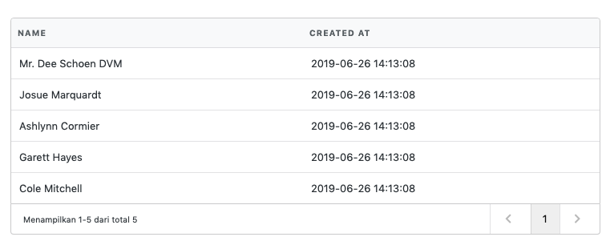

##### View

Jika konten kolom cukup kompleks, maka bisa menggunakan `View` untuk memindahkannya ke *dedicated file*.

```php
use Laravolt\Suitable\Columns\View;

View::make('users.address', 'Address')
```

###### resources/views/users/address.blade.php

```html
<dl>
    <dt>Address</dt>
    <dd>{{ $data->address }}, {{ $data->city->name }}, {{ $data->province->name }}</dd>
    <dt>Postal Code</dt>
    <dt>{{ $data->postal_code }}</dt>
</dl>
```

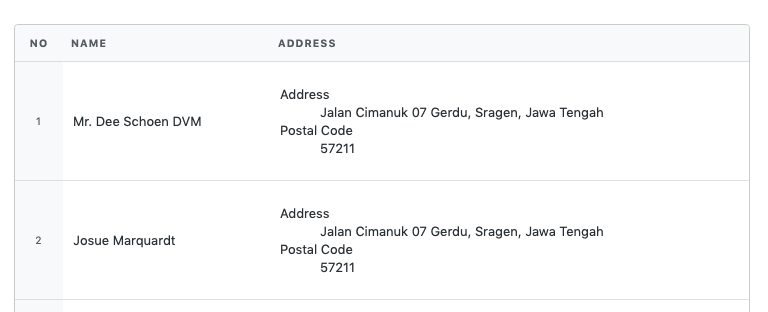

### Available Methods

Untuk setiap *predefined* `Column` di atas, ada beberapa method yang telah tersedia:

| Method                                   | Deskripsi                                                    |
| ---------------------------------------- | ------------------------------------------------------------ |
| `setHeaderAttributes(array $attributes)` | Untuk menambahkan atribut di tag `<th>` dari kolom yang bersangkutan. <br /> |
| `setCellAttributes(array $attributes)`   | Untuk menambahkan atribut di tag `<td>` dari setiap cell yang akan di-generate. |
| `sortable($param)`                       | `$param` dapat berisi Boolean (true false) atau `string` nama kolom yang akan dijadikan parameter ketika melakukan sorting. |
| `searchable($param)`                     | `$param` dapat berisi Boolean (true false) atau `string` nama kolom yang akan dijadikan parameter ketika melakukan filtering per kolom. |


## Auto Sort

Untuk melakukan sorting secara otomatis di level Query (Eloquent), telah tersedia trait `AutoSort` yang bisa dipasangkan di Model terkait.

Scope `autoSort` otomatis membaca query string dari URL dan mengaplikasikannya menjadi  query database di Model yang bersangkutan. Penamaan query string ditentukan oleh config: 

- `suitable.query_string.sort_by` (default to **“sort”**)

- `suitable.query_string.sort_direction` (default to **“direction”**)

###### Contoh URL

```html
http://localhost/users?sort=name&direction=desc
```

###### User.php

```php
use Laravolt\Suitable\AutoSort;

class User extends \Illuminate\Database\Eloquent\Model
{    
    use AutoSort;
}
```

###### UserController.php

```php
public function index()
{
    $users = User::autoSort()->paginate();
}
```

Jika penamaan query string berbeda dengan konfigurasi default, maka scope `autoSort()` bisa menerima 2 buah parameter, masing-masing untuk sort dan direction.

###### Contoh URL

```html
http://localhost/users?order_by=name&order_direction=desc
```

###### UserController.php

```php
public function index()
{
    $users = User::autoSort('order_by', 'order_direction')->paginate();
}
```


## Auto Filter

Untuk melakukan filtering secara otomatis di level Query (Eloquent), telah tersedia trait `AutoFilter` yang bisa dipasangkan di Model terkait.

###### User.php

```php
use Laravolt\Suitable\AutoFilter;

class User extends \Illuminate\Database\Eloquent\Model
{    
    use AutoFilter;
}
```

###### UserController.php

```php
public function index()
{
    // http://localhost/users?filter[name]=Jon&filter[email]=Dodo
    $users = User::autoFilter()->paginate();
}
```

By default, scope `autoFilter` akan membaca query string `filter` dari URL. Jika nama query string yang diberikan berbeda, silakan dicantumkan secara eksplisit sebagai parameter:

```php
public function index()
{
    // http://localhost/users?criteria[name]=Jon&criteria[email]=Dodo
    $users = User::autoFilter('criteria')->paginate();
}
```


## Export Ke PDF & Spreadsheet

Fitur ekspor ke PDF dan Spreadsheet (csv, xls, xlxs) telah tersedia sebagai `Plugin`. Care memakainya cukup mudah.

```php
use Laravolt\Suitable\Plugins\Pdf;
use Laravolt\Suitable\Plugins\Spreadsheet;

$users = User::paginate();

return (new UserTableView($users))
    ->plugins([
        new Pdf('users.pdf'),
        new Spreadsheet('users.xls')
    ])
    ->view('etalase::example.suitable');
```

Potongan kode di atas akan menambahkan 2 buah tombol di bagian view, sekaligus meng-handle pembuatan PDF dan Spreadsheet di bagian response (Controller). Dokumentasi untuk Plugin `Pdf` dan `Spreadsheet` bisa dibaca di bagian terkait.

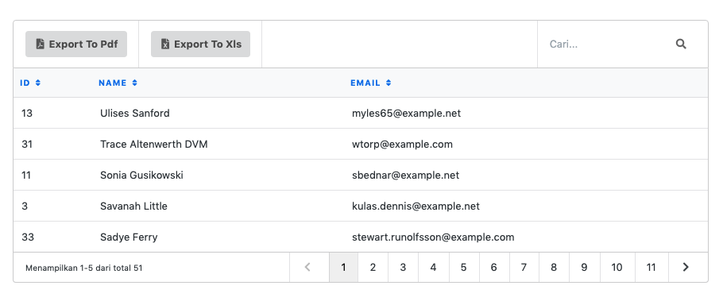

## Modifikasi Tampilan

### Anatomi

Gambar di bawah ini menjelaskan struktur tampilan Suitable:

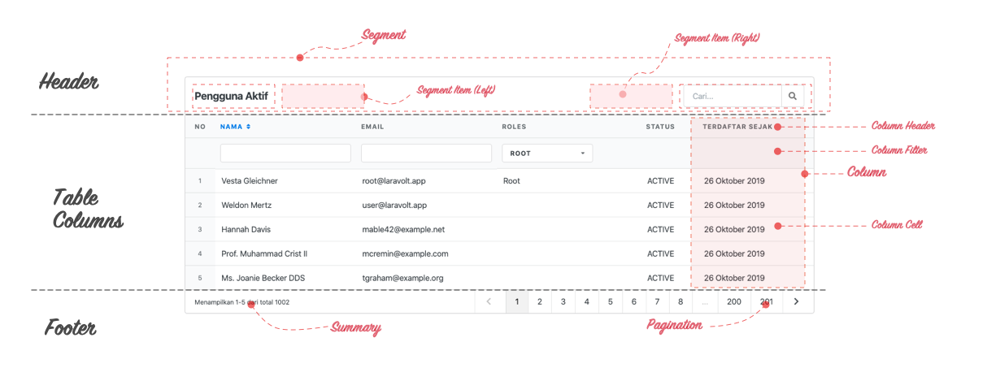

#### Header

Header adalah bagian atas tabel yang biasanya berisi judul, *searchbox*, dan tombol-tombol lain sesuai kebutuhan aplikasi. Header sendiri memiliki struktur seperti berikut:

- Header
    - Default Segment
        - Left
            - Judul
            - Item 1
            - Item 2
            - ...
        - Right
            - Searchbox
            - Item 1
            - Item 2
            - ...
    - Additional Segment
        - Left
            - Item 1
            - ...
        - Right
            - Item 1
            - ...

Segment bisa ditambah sesuai kebutuhan. Item di tiap segment juga bisa ditambah sesuai kebutuhan.

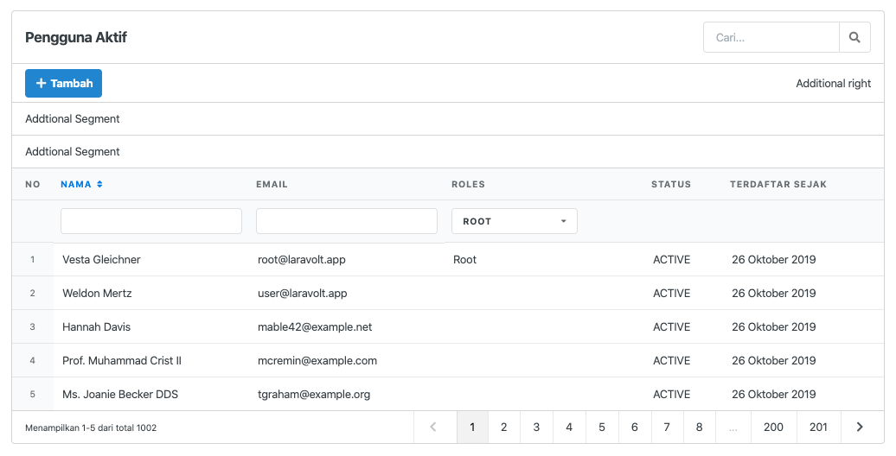

#### Table Columns

*Table Columns* merupakan tempat untuk menampilkan data. Disini kita bisa mendefinisikan header, filter, dan konten. Silakan baca [dokumentasi terkait Columns](#7-column) untuk informasi lebih lengkap.

#### Footer

Footer berisi ringkasan informasi terkait data yang ditampilkan dan deretan link untuk paginasi. Bagian ini tidak bisa dimodifikasi.

### Modifikasi Table Header

#### Gambaran Umum

Ketika sebuah `TableView` didefinisikan seperti berikut:

```php
protected $title = 'Pengguna Aktif';

protected $search = true;
```

dan kemudian menghasilkan tampilan seperti ini:

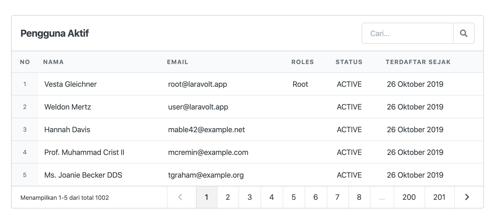

 maka sesungguhnya yang terjadi di balik layar adalah:

```php
$table->getDefaultSegment()->left(Text::make($table->title));

$table->getDefaultSegment()->right(Search::make($table->search));
```

Seperti yang sudah dijelaskan pada bagian anatomi, semua yang ada di header suatu Table sejatinya adalah Segment dan Segment Item (Toolbars). Satu Table bisa memiliki satu atau banyak Segment. Satu Segment bisa memiliki nol, satu, atau banyak Segment Item. Segment dan Segment Item inilah yang kemudian akan menentukan tampilan header dari suatu `Table`.

#### Segment

##### Membuat Segment

```php
use Laravolt\Suitable\Segments\Segment;

$segment = Segment::make('meaningful-segment-key');
```

##### Menambahkan Segment ke Table

```php
//$table adalah instance dari Laravolt\Suitable\Builder
$table->addSegment($segment);
```

##### Default Segment

By default, sebuah Table pasti memiliki satu buah Segment. Untuk mendapatkannya bisa dengan cara:

```php
$segment = $table->getDefaultSegment();
```

##### Menambah Segment Item

Sesuai penjelasan di bagian anatomi, sebuah Segment bisa memilki banyak Segment Item yang terbagi menjadi 2 posisi: left dan right. Untuk menambahkan Segment Item, method yang bisa digunakan adalah:

- `left()`, menambahkan satu atau lebih Item di posisi *left*. Item yang sudah ada sebelumnya akan ditimpa.
- `prependLeft()`, menambahkan satu atau lebih Item di **permulaan** *left*.
- `appendLeft()`, menambahkan satu atau lebih Item di **akhir** *left*.
- `right()`, menambahkan satu atau lebih Item di posisi *right*. Item yang sudah ada sebelumnya akan ditimpa.
- `prependRight()`, menambahkan satu atau lebih Item di **permulaan** *right*.
- `appendRight()`, menambahkan satu atau lebih Item di **akhir** *right*.

```php
$table->getDefaultSegment()->left('satu', 'dua', 'tiga');
$table->getDefaultSegment()->right('lima')->prependRight('empat')->appendRight('enam');
```


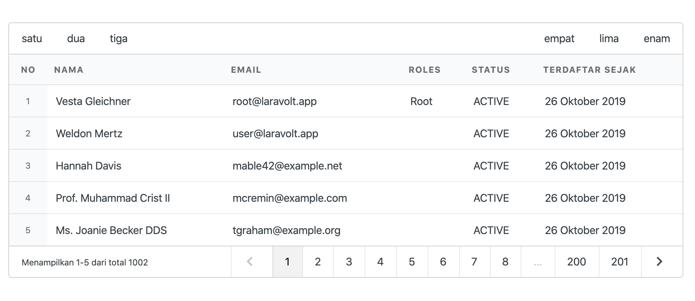

Dari contoh di atas kita bisa melihat bahwa Segment Item hanyalah sebuah `string` biasa. Oleh sebab itu kita bisa memasukkan tag HTML apapun.

Melanjutkan contoh sebelumnya, menambahkan potongan kode berikut ini:

```php
$table->getDefaultSegment()->appendLeft('<select class="ui dropdown"><option>Indonesia</option><option>Malaysia</option></select>');
```

akan menghasilkan tampilan seperti di bawah ini:

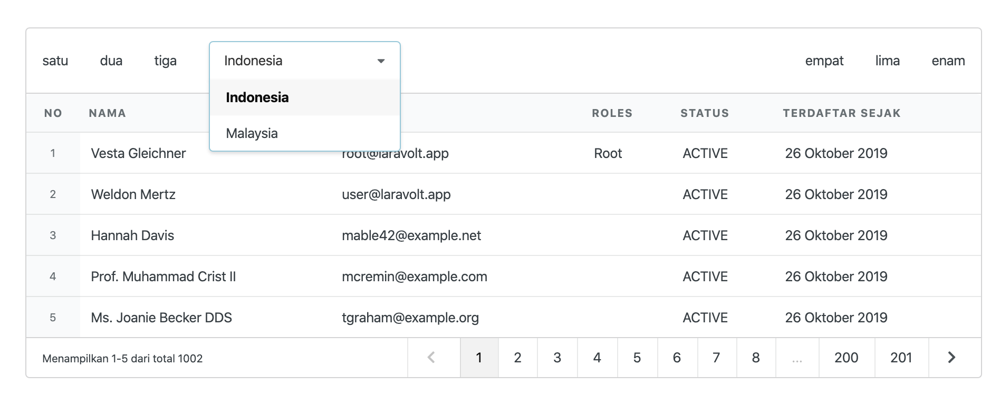

Untuk HTML yang cukup panjang, cara yang lebih baik adalah memindahkannya ke file view terpisah:

###### app/resources/views/components/dropdown.blade.php

```php+HTML
<select class="ui dropdown">
    <option>Indonesia</option>
    <option>Malaysia</option>
</select>
```

Lalu manfaatkan fungsi `view()->render()` bawaan Laravel:

```php
$table->getDefaultSegment()->appendLeft(view('dropdown')->render());
```

#### Segment Item

Cara lain untuk menambahkan Segment Item adalah membuat sebuah class yang mengimplementasikan *interface* `\Laravolt\Suitable\Contracts\Toolbar`.

```php
<?php

namespace Laravolt\Suitable\Contracts;

interface Toolbar
{
    public function render();
}
```

Sebagai contoh, kita akan membuat class DropdownNegara untuk menghasilkan dropdown yang berisi list negara.

###### app\Tables\Toolbars

```php
<?php

namespace App\Tables\Toolbars;

class DropdownNegara implements \Laravolt\Suitable\Contracts\Toolbar
{
    public function render()
    {
      	// sample logic, query to database
        $negara = \App\Models\Country::pluck('name', 'id');

      return view('components.dropdown', ['negara' => $negara])->render();
    }
}
```

Selanjutnya class tersebut bisa dipanggil dengan cara:

```php
$item = new App\Tables\Toolbars();
$table->getDefaultSegment()->appendLeft($item);
```


Sesuai konsep OOP, cara ini cocok dipakai jika tampilan Segment Item cukup kompleks dan melibatkan *logic* di dalamnya. Demikian juga ketika ada banyak Segment Item yang sama di beberapa tempat, maka membuat sebuah class khusus menjadi wajib hukumnya demi menjaga *maintainability* dan tidak melanggar prinsip DRY (*Don't Repeat Yourself*).

#### Predefined Segment Item

Suitable sudah menyediakan beberapa Segment Item yang bisa langsung dipakai:

1. `Laravolt\Suitable\Toolbars\Action`
2. `Laravolt\Suitable\Toolbars\DropdownFilter`
3. `Laravolt\Suitable\Toolbars\Search`
4. `Laravolt\Suitable\Toolbars\Text`

##### Action

```php
Action::make($icon, $label, $url);
```

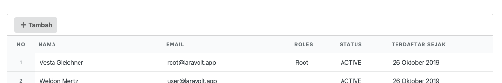

##### DropdownFilter

```php
DropdownFilter::make($name, $options);
```

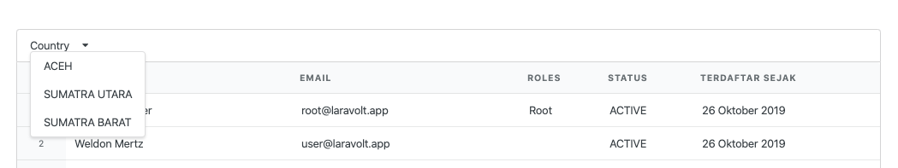

##### Search

```php
Search::make($name);
```

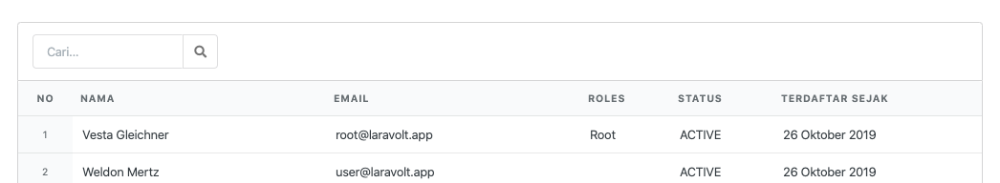

##### Text

```php
Text::make($label)
```

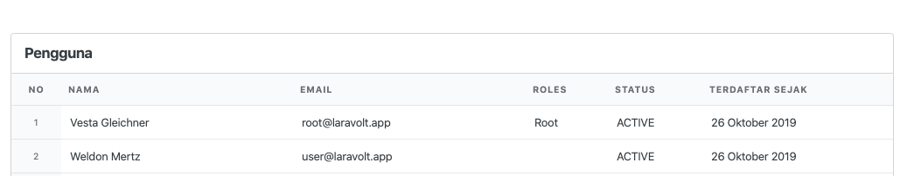

### Dimana Menempatkan Kode Untuk Modifikasi Tampilan?

#### Overview

Pada bagian-bagian sebelumnya sudah dijelaskan bagaimana caranya memodifikan tampilan sebuah `Table`. Pertanyaan berikutnya yang muncul adalah di mana kode-kode tersebut ditempatkan?

Untuk menjawab pertanyaan tersebut, Suitable menyediaan sebuah fungsi bernama `decorate`. Mari kita pelajari cara pemakaiannya.

#### Modifikasi Table Dengan `decorate()`

##### Saat *Initialization*

Class `TableView` memiliki sebuah method `init()` yang bisa digunakan untuk mengeksekusi apapun setelah Table di-*create*, termasuk memanggil method `decorate()`. Menempatkan `decorate` di dalam `init` berarti semua class UserTable akan menghasilkan tampilan yang sama dimanapun dipanggilnya.

###### app\Tables\UserTable.php

```php
class UserTable extends TableView
{
  protected function init()
  {
    $this->decorate(function (\Laravolt\Suitable\Builder $table) {
      $table->getDefaultSegment()->left('satu', 'dua', 'tiga');
      $table->getDefaultSegment()->right('lima')->prependRight('empat')->appendRight('enam');
    });
  }  
}
```

##### Saat *Runtime*

Jika yang dikehendaki adalah memodifikasi salah satu *instance* UserTable tanpa menimbulkan efe ke UserTable yang lain, maka `decorate()` bisa dipanggil saat *runtime*.

###### app\Http\Controllers\UserController.php

```php
class UserController extends Controller 
{
  return (new UserTable($users))
    ->decorate(function (Builder $table) {
      $table->getDefaultSegment()->left('satu', 'dua', 'tiga');
      $table->getDefaultSegment()->right('lima')->prependRight('empat')->appendRight('enam');
    })
    ->view('users.index');
  
}
```

