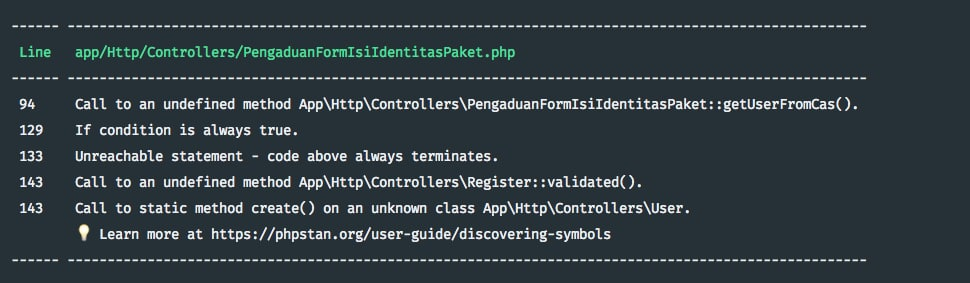

# Code Quality

## Prolog

Bagaimana jika bug bisa terdeteksi tanpa harus menge-*run* program? Bagaimana jika bug bisa terdeteksi secara otomatis, tanpa harus melakukan *code review*?



Pesan di atas adalah contoh hasil *static code anlysis* dengan **Larastan** terhadap kode yang sudah lolos *code review*. Larastan 1, code reviewer 0.

Kemampuan dan energi *code reviewer* (manusia) ada batasnya. Hal ini yang kadang menyebabkan kode yang buruk masih bisa lolos reviu dan naik ke *production*. Untuk itulah peran *tools* sepert Larastan menjadi sangat penting untuk menjaga kualitas kode. Selain karena bukan manusia (jadi tidak ada kata lelah), melakukan reviu kode dengan menggunakan *tools* juga lebih obyektif karena ada seperangkat *rules* yang terdefinisi dan telah disepakati sebelumnya.

## Code Style

### Tujuan

Memastikan cara penulisan kode seragam antar programmer meskipun menggunakan IDE/editor yang berbeda.

### Tools

https://github.com/FriendsOfPHP/PHP-CS-Fixer

### Instalasi

```bash
composer require friendsofphp/php-cs-fixer --dev
```


### Pemakaian

> 🌟 Jalankan perintah-perintah berikut ini dari folder aplikasi.

Melakukan *fixing* otomatis:

```bash
vendor/bin/php-cs-fixer fix --diff --diff-format udiff
```

Melakukan pengecekan saja tanpa *fixing*, tambahkan opsi `--dry-run`:

```bash
vendor/bin/php-cs-fixer fix --dry-run --diff --diff-format udiff
```

Jika command-nya terlalu panjang untuk diingat, tambahkan shortcut/alias ke composer.json:

```json
"scripts": {
 "cs-check": [
    "vendor/bin/php-cs-fixer fix --dry-run --diff --diff-format udiff"
  ],
  "cs-fix": [
    "vendor/bin/php-cs-fixer fix --diff --diff-format udiff"
  ]
}
```

Selanjutnya, kita cukup memanggil alias yang sudah didefinisikan di atas:

```bash
composer cs-check
composer cs-fix
```


### Konfigurasi

###### .php_cs

```php
<?php

use PhpCsFixer\Config;
use PhpCsFixer\Finder;

$rules = [
    'array_syntax' => ['syntax' => 'short'],
    'binary_operator_spaces' => [
        'default' => 'single_space',
    ],
    'blank_line_after_namespace' => true,
    'blank_line_after_opening_tag' => true,
    'blank_line_before_statement' => [
        'statements' => ['return'],
    ],
    'braces' => true,
    'cast_spaces' => true,
    'class_attributes_separation' => [
        'elements' => ['method'],
    ],
    'class_definition' => true,
    'concat_space' => [
        'spacing' => 'none',
    ],
    'declare_equal_normalize' => true,
    'elseif' => true,
    'encoding' => true,
    'full_opening_tag' => true,
    'fully_qualified_strict_types' => true, // added by Shift
    'function_declaration' => true,
    'function_typehint_space' => true,
    'heredoc_to_nowdoc' => true,
    'include' => true,
    'increment_style' => ['style' => 'post'],
    'indentation_type' => true,
    'linebreak_after_opening_tag' => true,
    'line_ending' => true,
    'lowercase_cast' => true,
    'lowercase_constants' => true,
    'lowercase_keywords' => true,
    'lowercase_static_reference' => true, // added from Symfony
    'magic_method_casing' => true, // added from Symfony
    'magic_constant_casing' => true,
    'method_argument_space' => true,
    'native_function_casing' => true,
    'no_alias_functions' => true,
    'no_extra_blank_lines' => [
        'tokens' => [
            'extra',
            'throw',
            'use',
            'use_trait',
        ],
    ],
    'no_blank_lines_after_class_opening' => true,
    'no_blank_lines_after_phpdoc' => true,
    'no_closing_tag' => true,
    'no_empty_phpdoc' => true,
    'no_empty_statement' => true,
    'no_leading_import_slash' => true,
    'no_leading_namespace_whitespace' => true,
    'no_mixed_echo_print' => [
        'use' => 'echo',
    ],
    'no_multiline_whitespace_around_double_arrow' => true,
    'multiline_whitespace_before_semicolons' => [
        'strategy' => 'no_multi_line',
    ],
    'no_short_bool_cast' => true,
    'no_singleline_whitespace_before_semicolons' => true,
    'no_spaces_after_function_name' => true,
    'no_spaces_around_offset' => true,
    'no_spaces_inside_parenthesis' => true,
    'no_trailing_comma_in_list_call' => true,
    'no_trailing_comma_in_singleline_array' => true,
    'no_trailing_whitespace' => true,
    'no_trailing_whitespace_in_comment' => true,
    'no_unneeded_control_parentheses' => true,
    'no_unreachable_default_argument_value' => true,
    'no_unused_imports' => true,
    'no_useless_return' => true,
    'no_whitespace_before_comma_in_array' => true,
    'no_whitespace_in_blank_line' => true,
    'normalize_index_brace' => true,
    'not_operator_with_successor_space' => true,
    'object_operator_without_whitespace' => true,
    'ordered_imports' => ['sortAlgorithm' => 'alpha'],
    'phpdoc_indent' => true,
    'phpdoc_inline_tag' => true,
    'phpdoc_no_access' => true,
    'phpdoc_no_package' => true,
    'phpdoc_no_useless_inheritdoc' => true,
    'phpdoc_scalar' => true,
    'phpdoc_single_line_var_spacing' => true,
    'phpdoc_summary' => true,
    'phpdoc_to_comment' => true,
    'phpdoc_trim' => true,
    'phpdoc_types' => true,
    'phpdoc_var_without_name' => true,
    'psr4' => true,
    'self_accessor' => true,
    'short_scalar_cast' => true,
    'simplified_null_return' => false, // disabled by Shift
    'single_blank_line_at_eof' => true,
    'single_blank_line_before_namespace' => true,
    'single_class_element_per_statement' => true,
    'single_import_per_statement' => true,
    'single_line_after_imports' => true,
    'single_line_comment_style' => [
        'comment_types' => ['hash'],
    ],
    'single_quote' => true,
    'space_after_semicolon' => true,
    'standardize_not_equals' => true,
    'switch_case_semicolon_to_colon' => true,
    'switch_case_space' => true,
    'ternary_operator_spaces' => true,
    'trailing_comma_in_multiline_array' => true,
    'trim_array_spaces' => true,
    'unary_operator_spaces' => true,
    'visibility_required' => [
        'elements' => ['method', 'property'],
    ],
    'whitespace_after_comma_in_array' => true,
];

$project_path = getcwd();
$finder = Finder::create()
    ->in([
        $project_path.'/app',
        $project_path.'/config',
        $project_path.'/database',
        $project_path.'/modules/Pengaduan/Controllers',
        $project_path.'/resources',
        $project_path.'/routes',
        $project_path.'/tests',
    ])
    ->name('*.php')
    ->notName('*.blade.php')
    ->ignoreDotFiles(true)
    ->ignoreVCS(true);

return Config::create()
    ->setFinder($finder)
    ->setRules($rules)
    ->setRiskyAllowed(true)
    ->setUsingCache(true);

```


## Static Analysis

### Tujuan

Menemukan bug sebelum bug menemukan kita.

### Tools

- https://phpstan.org/
- https://github.com/nunomaduro/larastan

### Instalasi

```bash
composer require --dev nunomaduro/larastan
```


### Konfigurasi

###### phpstan.neon

```yaml
includes:
    - ./vendor/nunomaduro/larastan/extension.neon

parameters:
	level: neon
	paths:
		- app
		- modules
		- tests
```

### Pemakaian

```bash
vendor/bin/phpstan analyse
```

## 

## Cognitive Complexity

### Tujuan

Memastikan kode mudah dibaca dan di-*maintain* untuk jangka waktu yang panjang.

### Tools

https://www.sonarlint.org/

### Instalasi

- https://blog.javan.co.id/meningkatkan-code-quality-dengan-plugin-sonarlint-di-intellij-idea-36705b6cd8fa
- https://blog.javan.co.id/cara-mudah-meningkatkan-kualitas-kode-menggunakan-sonar-37c6f8e0239b

### Pemakaian

## GrumPHP

### Tujuan

Menjalankan semua tools di atas setiap kali kita melakukan perubahan kode bisa jadi menyita cukup waktu dan berpotensi lupa. Oleh sebab itu, Laravolt sudah dilengkapi dengan GrumpPHP (https://github.com/phpro/grumphp) yang akan melakukan pengecekan secara otomatis setiak kali kita melakukan commit. Jika ada satu saja pengecekan yang gagal, maka commit tidak bisa dilakukan dan kita harus memperbaiki kode terlebih dahulu.

### Instalasi

```bash
composer require --dev phpro/grumphp
```


### Konfigurasi

###### grumphp.yml

```yaml
grumphp:
  tasks:
    phpcsfixer2:
      config: .php_cs
    phpstan:
      configuration: phpstan.neon
      use_grumphp_paths: false

```

### Pemakaian

#### Pengecekan Manual

```bash
vendor/bin/grumphp run
```

#### Otomatis

```bash
vendor/bin/grumphp git:init
```

Setelah kode di atas dijalankan, maka GrumPHP akan dijalankan secara otomatis sebelum commit.