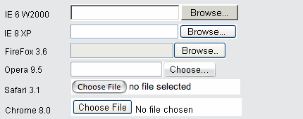
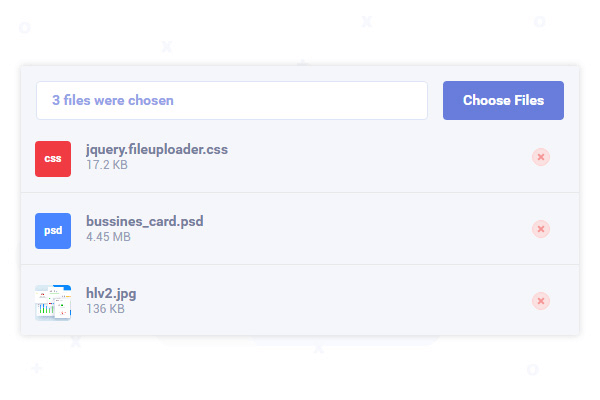
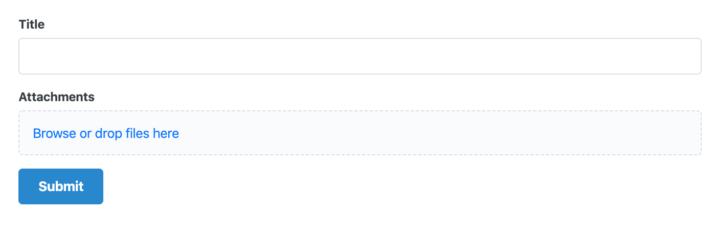
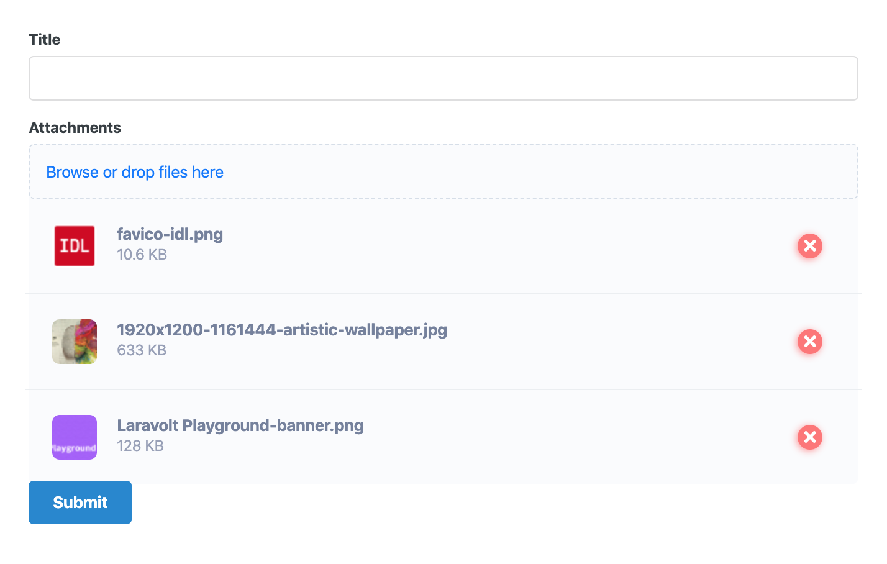
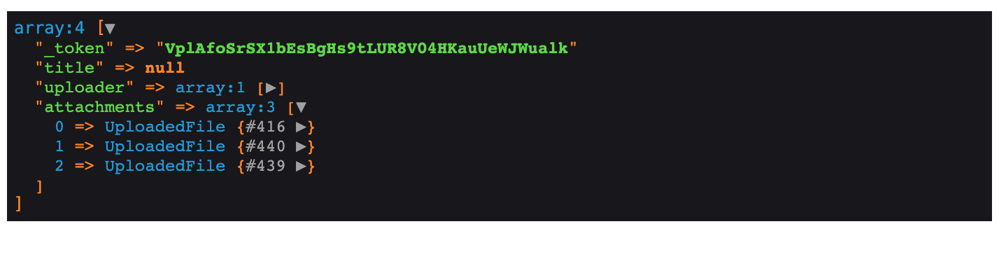

# Multiple File Upload

## Intro

Salah satu fitur yang sering dibutuhkan dalam sebuah sistem informasi adalah upload (mengunggah) file. HTML sendiri sebenarnya sudah menyediakan input jenis ini secara default, yaitu menggunakan `<input type="file">` (single file) atau `<input type="file" multiple>` (multiple file).



Hanya saja biasanya pengguna ingin dibuatkan tampilan yang lebih cantik, misalnya ingin diperlihatkan thumbnail, ditambahkan tombol hapus, bisa drag n drop, atau copy paste gambar dari clipboard.

 

Dengan kebutuhan seperti itu, fitur upload bawaan HTML sudah pasti tidak bisa mengakomodir. Butuh "sedikit" bantuan dari Javascript. Hanya saja terkadang proses integrasi Javascript ini sedikit merepotkan programmer dan Laravolt memahami kebutuhan ini. Oleh sebab itu, Laravolt `semantic-form` sudah menyediakan sebuah fitur untuk membuat upload file yang cantik, dinamis, dan mudah diintegrasikan.

## Upload File Dengan `semantic-form`

Salah satu fungsi yang disediakan oleh Laravolt adalah *form builder* menggunakan package [semantic-form](/docs/semantic-form). Langkah-langkah membuat sebuah form untuk upload file bisa dilihat pada bagian selanjutnya.

### Persiapkan View

Menggunakan form builder Laravolt, kita bisa menambahkan potongan kode berikut:

###### resources/views/posts/create.blade.php

```php+HTML
{!! form()->open(route('posts.store'))->multipart() !!}
{!! form()->uploader('attachments')->label('Attachments') !!}
{!! form()->submit('Submit') !!}
{!! form()->close() !!}
```

Kode di atas akan menghasilkan tampilan seperti ini:



*By default* hanya 1 file yang bisa dipilih. Jika ingin bisa upload lebih dari satu file sekaligus, bisa menambahkan `limit()`.

```php
{!! form()->uploader('attachments')->limit(10)->label('Attachments') !!}
```

Untuk membatasi hanya ekstensi tertentu yang diperbolehkan, bisa menambahkan `extensions()`.

```php
{!! form()->uploader('attachments')->limit(10)->extensions(['jpg', 'png'])->label('Attachments') !!}
```




> **Wajib** untuk menambahkan `form()->multipart()` jika form mengandung input file atau file tidak akan diupload ke server.

### Penanganan File di Controller

Mencoba submit form dan melakukan `dd(request()->all())` di controller, kita bisa mengecek bahwa data file berhasil dikirim:



Sampai sini, kita bisa memakai 2 cara untuk menyimpan file:

1. [Cara biasa ala Laravel](https://laravel.com/docs/5.8/filesystem#file-uploads)
2. Memanfaatkan package [laravel-medialibrary](https://docs.spatie.be/laravel-medialibrary/v7/introduction/)

Cara yang direkomendasikan Laravolt adalah memakai medialibrary. Selanjutnya, yang perlu dilakukan adalah menambahkan kode berikut di controller:

```php
...
$post = Post::findOrFail($id);
$post->addMediaFromRequest('attachments')->toMediaCollection();
...
```

> Pastikan [instalasi medialibrary](https://docs.spatie.be/laravel-medialibrary/v7/installation-setup/) sudah benar dilakukan.