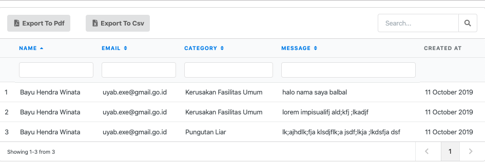
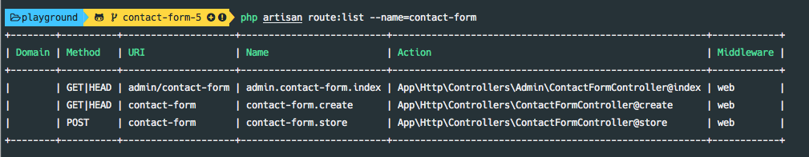

# Contact Form

Pada studi kasus sebelumnya, kita sudah berhasil membuat sebuah form yang berfungsi lengkap: mulai dari validasi, menyimpan data, hingga mengirimkan notifikasi.

Sekarang kita akan menambahkan halaman bagi Admin untuk melihat semua *contact form* yang masuk. Kira-kira tampilannya seperti di bawah ini. Sebuah tabel lengkap dengan searching, filter per kolom, sorting, serta ekspor ke PDF dan CSV.



## 1. Menyiapkan Halaman Admin

URL untuk admin nantinya adalah `/admin/contact-form`.

### 1.1. Membuat Route dan Controller

Daftarkan route baru di posisi paling bawah.

###### routes/web.php

```php
Route::prefix('admin')->namespace('Admin')->as('admin.')->group(function () {
    Route::get('contact-form', 'ContactFormController@index')->name('contact-form.index');
});
```

Lalu jalankan perintah untuk meng-generate Controller:

```bash
php artisan make:controller Admin/ContactFormController
```

Pastikan route sudah terdaftar dengan mengecek di console melalui perintah:

```bash
php artisan route:list --name=contact-form
```




Lanjut di telegram..