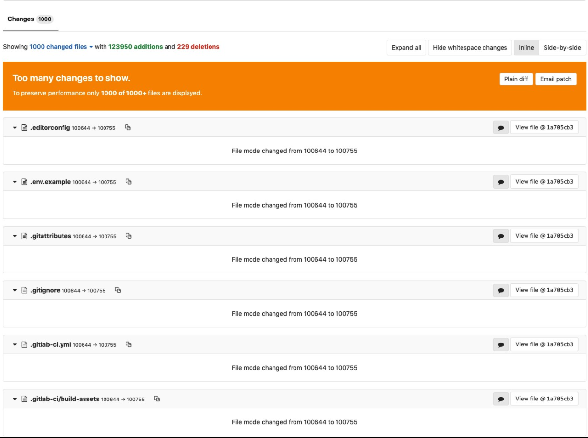

# File Permissions

Memberikan hak akses (permission) yang tepat untuk setiap file dan folder merupakan salah satu syarat penting untuk memudahkan proses development. Selain itu, pengaturan hak akses yang tepat berperan penting dalam aspek keamanan sebuah aplikasi agar terhindar dari ulah jahil pihak yang tidak bertanggung jawab.

## 755 Untuk Folder

Permission 755 artinya:

- *Owner* memilik akses penuh (read + write + execute).
- Grup hanya read-only.
- Publik hanya read-only.

## 644 Untuk File

Permission 644 artinya:

- *Owner* memiliki akses penuh (read + write). Untuk PHP, akses `execute` file tidak diperlukan karena file PHP dieksekusi dengan cara **dibaca (diparsing/read)**.
- Grup hanya read-only.
- Publik hanya read-only.

## Git: Ignore Perubahan File Mode

Hak akses 755 dan 644 adalah hak akses standard, dan sudah diset sedemikian rupa saat pertama kali melakukan `git clone` atau `composer create-project`.

Namun, ada kasus dimana terkadang programmer harus mengubah permission dari folder dan file agar aplikasi dapat berjalan dengan lancar di localhost. Hal ini bisa mengakibatkan ***unwanted commits*** seperti di bawah ini:



Perubahan akses (*file mode*) terhadap file seperti di atas sebaiknya dihindari. Caranya adalah dengan meminta Git untuk mengabaikan perubahan file mode.

###### Per Project

```bash
git config core.fileMode false
```

###### Global

```bash
git config --global core.fileMode false
```

