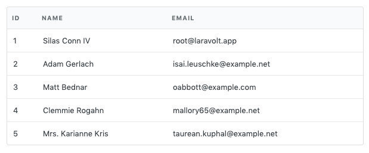
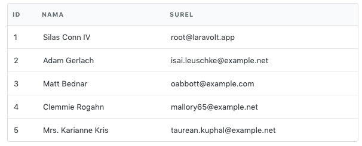
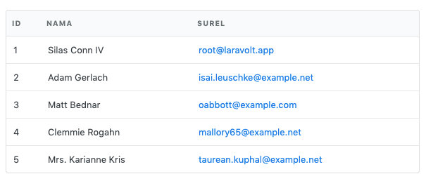

# Suitable

Suitable adalah helper untuk menampilkan data dari Eloquent menjadi tabel (datatable) dengan struktur HTML sesuai standard Fomantic UI. Fitur-fitur yang tersedia:

1. Membuat datatable cukup 1 baris
2. Column sorting (server side)
3. Column filtering (server side)
4. Searching (server side)
5. Ekspor ke PDF, CSV, XLS, XLSX (server side)
6. Pagination (server side)
7. Custom column definition

Semua pengolahan data dilakukan di server side tanpa bantuan Javascript. Untuk mengurangi white flicker delay ketika refresh halaman, kami sarankan menggunakan teknologi seperti pjax atau turbolink.

## Penggunaan

Ada 2 cara menampilkan tabel menggunakan Suitable, yaitu sebagai HTML Builder atau sebagai TableView. Sebagai HTML Builder, kamu langsung memanggil helper class `Suitable` untuk mendefinisikan tabel yang ingin dihasilkan. Builder hanya bertugas menghasilkan `string` HTML. Titik. 

Sedangkan sebagai TableView, sebuah tabel direpresentasikan dalam sebuah kelas `TableView` dimana kelas ini selain bertanggung jawab menghasilkan string HTML juga dapat digunakan untuk memanipulasi response dari `Controller`, misalnya untuk menghasilkan file PDF atau spreadsheet.

### HTML Builder

Penggunaan paling sederhana Suitable adalah sebagai HTML builder, dimana Suitable dapat menghasilkan tag HTML untuk menampilkan data dalam bentuk tabel. Output yang dihasilkan, setelah memanggil method `render()`, hanyalah string biasa. Oleh karena itu, pemanggilan Suitable bisa dilakukan dimana saja.

**Langsung dipanggil di view**

```php
{!! Suitable::source($data)->render() !!}
```

**Build di controller, ditampilkan di view**

```php
// UserController.php
public function index()
{
  	$data = \App\User::all();
  	$table = Suitable::source($data)->render();

  return view('users.index');
}

// resources/views/users/index.blade.php
{!! $table !!}
```


#### Contoh

##### Tabel Sederhana

```php
Suitable::source($users)
  ->columns(['id', 'name', 'email'])
  ->render()
```



##### Custom Header

```php
Suitable::source($users)
  ->columns([
    'id',
    ['header' => 'Nama', 'field' => 'name'],
    ['header' => 'Surel', 'field' => 'email'],
  ])
  ->render()
```



##### Raw HTML

```php
Suitable::source($users)
  ->columns([
    'id',
    ['header' => 'Nama', 'field' => 'name'],
    ['header' => 'Surel', 'raw' => function ($user) {
      return sprintf('<a href="mailto:%s">%s</a>', $user->email, $user->email);
    }],
  ])
  ->render()
```



##### Custom Cell View

```php

```


##### Custom Row View

```php

```


### TableView