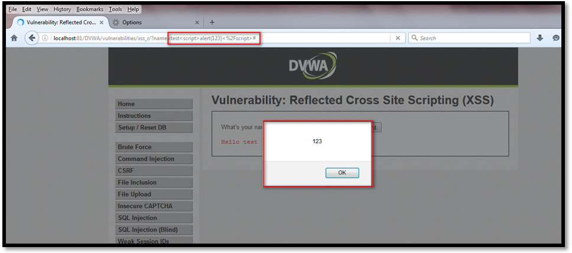
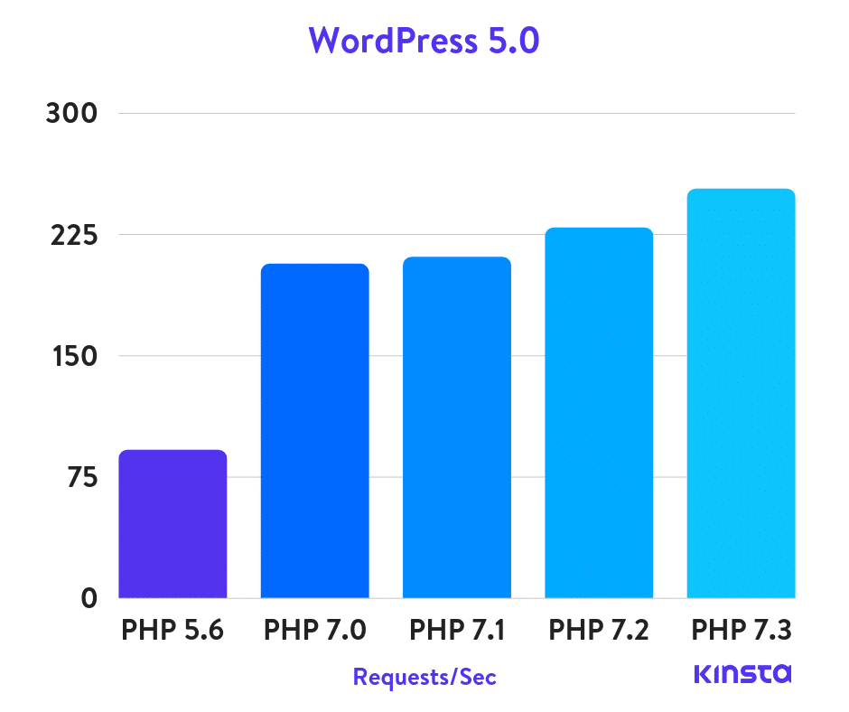
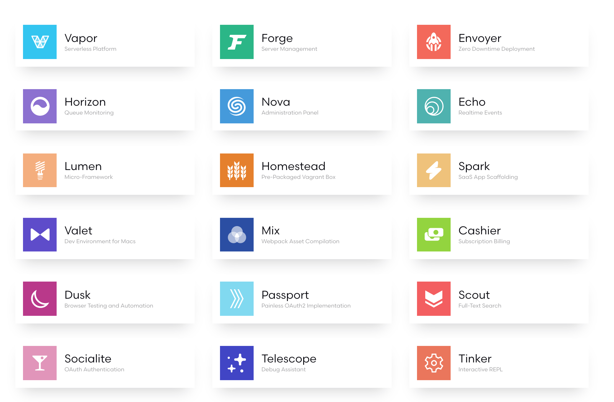

---

title: PHP & Security
description: Don't be misguided. Do it the right way.
extends: _layouts.documentation
section: content
---

# Enterprise PHP: Security & Performance

PHP bukan satu-satunya pilihan untuk membangun sebuah sistem informasi, dan biasanya bukan pilihan utama ketika sistem informasi yang akan dibangun sudah berskala *enterprise*. Java dan .NET biasanya lebih menjadi pilihan, dengan berbagai macam pertimbangan: performa, keamanan, atau sudah terlanjur beli lisensi. PHP masih dipandang sebagai anak bawang atau kasta kedua. Alasannya klasik, performa dan kemananannya diragukan.

Benarkah demikian?


## Security

Dari dulu PHP itu ibarat permen: ringan, murah, dan mudah didapatkan. Setiap orang bisa mencoba dan *up & running* dalam waktu singkat. Berbeda dengan Java, yang butuh hardware cukup mumpuni untuk sekedar membuka Netbeans atau IDE lainnya, atau .Net yang (dulu) hanya bisa dijalankan di Windows. PHP menjadi mainstream, dan oleh karenanya programmer PHP mudah sekali didapatkan. Bahkan yang belum pernah pegang sama sekali juga berani bilang "Saya bisa PHP", karena memang PHP mudah dipelajari.

Boom, belasan aplikasi bisa dihasilkan oleh seorang mahasiswa yang bahkan belum lulus. Fokus pada fitur yang nampak, menggunakan PHP bisa sangat produktif. Apalagi banyak proyek open source yang bisa dicomot-comot kodenya. PHP yang awalnya didesain untuk membuat website, kemudian berkembang juga untuk membangun aplikasi berbasis web yang melibatkan data penting. Untuk website, resiko ketika ada celah keamanan paling buruk  adalah di-deface, diutak-atik tampilan situsnya. Tapi kalau aplikasi web, ada resiko kehilangan data penting.

Perpaduan programmer pemula (yang hanya fokus pada fitur yang nampak) dan konsep web yang bisa diakses secara terbuka lewat internet menjadikan (aplikasi berbasis) PHP menjadi sasaran empuk untuk diserang.

Itu dulu.

Sekarang, dengan kehadiran PHP 7.x dan berbagai framework, angin segar perubahan telah berhembus untuk para programmer dan pelaku bisnis. Lapisan kemanan ditingkatkan, baik di level library PHP atau di level framework.

### Password Hashing

Dulu, programmer terbiasa menggunakan `md5` untuk *password hashing*.

```php
$password = md5($_POST['password']);

// atau
$password = md5(md5(md5($_POST['password']))); // md5 3 level ^_^
```

Mau level berapapun, melakukan hashing tanpa algoritma yang mendukung salt ya percuma saja.

Solusinya, framework seperti Laravel sudah menyediakan *one-way hasing algorithm* yang terbukti lebih aman dan tidak bisa dibongkar:

```php 
$password = bcrypt($_POST['password']);
```

### SQL injection

Dulu, fungsi `mysql_query()` menjadi satu-satunya cara untuk berinteraksi dengan MySQL. 

```php
mysql_query("select * from users where username = '$username' AND password = '$password'");
```

Dengan sedikit trik, hacker bisa mengisikan `' or '1' = '1` dan menghasilkan query seperti di bawah:

```php
mysql_query("select * from users where username = '' or '1' = '1 AND password = '' or '1' = '1");
```

Hasilnya, query selalu memberikan hasil dan hacker bisa login ke aplikasi.

Solusinya, PHP sudah menyediakan library `PDO` dan `mysqli` yang lebih modern dan aman terhadap SQL injection.

### XSS

XSS atau Cross Site Scripting adalah kondisi dimana hacker menyisipkan potongan kode yang ketika ditampilkan akan dieksekusi oleh browser karena potongan kode tersebut memiliki makna khusus.



Karena PHP sejatinya adalah *templating engine*, maka akan sering kita jumpai potongan kode yang bercampur antara PHP dan HTML:

```php+HTML
<h3>
    Selamat datang, <?php echo $_GET['name'] ?>
</h3>
```

Sesuai contoh pada gambar di atas, dengan sedikit pengetahuan Javascript hacker bisa memodifikasi URL yang mengakibatkan tereksekusinya sebuah aksi memunculkan browser dialog. Dengan berhasil mengeksekusi Javascript, maka ada peluang bagi hacker untuk melakukan kejahatan lain, seperti:

1. Membajak session seseorang.
2. Melakukan aktivitas atas nama orang lain.
3. Mencatat *keystroke* (tombol mana saja yang dipencet), bisa digunakan untuk mencuri password atau info kartu kredit.

Solusinya, PHP telah menyediakan fungsi untuk meng-*escape* berbagai karakter khusus agar tidak dieksekusi oleh browser, melainkan ditampilkan apa adanya.

```php+HTML
<h3>
    Selamat datang, <?php echo htmlspecialchars($_GET['name']) ?>
</h3>
```

Framework PHP modern juga sudah menyediakan *template engine* yang powerful, mudah digunakan, dan lebih aman dibanding *template engine* *built-in* PHP itu sendiri. Ada [Twig](https://twig.symfony.com/), [Smarty](https://www.smarty.net/), atau [Blade](https://laravel.com/docs/5.8/blade).  

```php+HTML
<h3>Selamat datang, {{ $_GET['name'] }}</h3> // auto escape magic characters
```


## Performance

Ketika membicarakan aplikasi skala enterprise, maka tidak adil kalau hanya membicarakan satu aspek saja, yaitu terkait bahasa pemrogramannya. PHP, Java, atau bahasa lainnya hanya merupakan satu bagian kecil yang mempengaruhi performa aplikasi. Masih ada faktor *database*, *server*, *storage*, *network*, dan lain-lain. 

Di level enterprise, yang harusnya kita bicarakan adalah **arsitektur sistem**. Lebih memilih A dibanding B sebagai solusi tanpa melihat secara keseluruhan arsitektur sistem yang diajukan, ibarat mempekerjakan kontraktor untuk membangun rumah hanya karena dia membawa mesin bor paling cepat dan bertenaga, tanpa Anda pernah mengevaluasi denah, rancang bangun, dan profil tukang yang dibawa.

Zaman sekarang sudah tidak relevan lagi mengatakan PHP lambat untuk level enterprise. Ada banyak layanan yang dibuat dengan PHP, yang bahkan melebihi level enterprise, yang bisa kita akses setiap hari dan kita tidak mengeluh lambat. Ada [facebook](https://www.zdnet.com/article/why-facebook-hasnt-ditched-php/), [wikipedia](https://meta.wikimedia.org/wiki/Wikimedia_servers), atau situs berita [time.com](https://time.com/). Untuk level Indonesia  ada tiket.com (CodeIgniter), Urbanindo (Yii), dan https://tafsirq.com/ (Laravel). 

Secara internal, *engine* PHP sendiri selalu meningkat performanya dari waktu ke waktu. Menggunakan WordPress sebagai alat uji, kita wajib tersenyum melihat grafik di bawah ini.



## Penutup

PHP lambat atau tidak aman karena berada di tangan yang salah, atau berada di arsitektur yang salah. Hal yang sama juga bisa terjadi di Java atau bahasa pemrograman lainnya. Tren 3 tahun kebelakang memperlihatkan PHP masih berkembang cukup pesat, terutama di Indonesia. Programmer mulai beralih dari CodeIgniter yang jadul dan mulai usang ke framework yang lebih modern seperti Symfony, Laravel atau Phalcon. 

Apresiasi khusus untuk Laravel, yang tidak hanya menyediakan framework, tetapi juga menyediakan ekosistem dan *tools* pendukung untuk membangun aplikasi level enterprise dengan cepat. 

Butuh *serverless architecture*? Ada [Vapor](https://vapor.laravel.com/).

Butuh realtime chat? Ada [Echo](https://laravel.com/docs/5.8/broadcasting).

Butuh automated test? Ada [Dusk](https://laravel.com/docs/5.8/dusk).

Butuh mengembangkan SaaS? Ada [Spark](https://spark.laravel.com/).

Butuh admin panel instant? Ada [Nova](https://nova.laravel.com/) (berbayar) atau [Laravolt](https://laravolt.dev/) (gratis).

Dan masih banyak lagi...




...


Untuk yang masih antipati dengan PHP, "*a poor workman always blames his tools*".